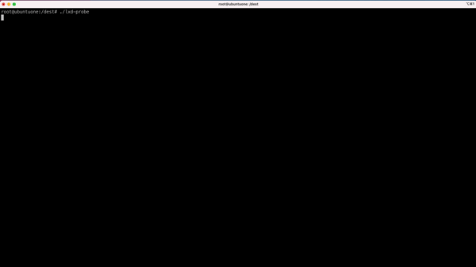

[](https://goreportcard.com/report/github.com/chen-keinan/lxd-probe)
[](https://github.com/chen-keinan/lxd-probe/blob/main/LICENSE)

[](https://gitter.im/beacon-sec/lxd-probe?utm_source=badge&utm_medium=badge&utm_campaign=pr-badge)

<br><br>
# lxd-probe

###  Scan your Linux container (LXD / LXC) runtime !!
Lxd-Probe is an open source audit scanner who perform audit check on a linux container manager and output it security report.

The audit tests are the full implementation of [CIS Lxd Benchmark specification](https://www.cisecurity.org/benchmark/lxd/) <br>

audit result now can be leveraged as webhook via user plugin(using go plugin)
#### Audit checks are performed on linux containers, and output audit report include :
 1.  root cause of the security issue.
 2. proposed remediation for security issue

#### Linux container audit scan output:



--------------------------------------------------------------------------------------------------------

* [Installation](#installation)
* [Quick Start](#quick-start)
* [User Plugin Usage](#user-plugin-usage)
* [Supported Specs](#supported-specs)
* [Contribution](#Contribution)

## Installation

```
git clone https://github.com/chen-keinan/lxd-probe
cd lxd-probe
make build
./lxd-probe
```

Note : lxd-probe require privileged user to execute tests.

## Quick Start

```
Usage: lxd-probe [--version] [--help] <command> [<args>]

Available commands are:
  -r , --report :  run audit tests and generate failure report
  -i , --include:  execute only specific audit test,   example -i=1.2.3,1.4.5
  -e , --exclude:  ignore specific audit tests,  example -e=1.2.3,1.4.5
  -c , --classic:  test report in classic view,  example -c

```
## User Plugin Usage
The lxd-probe expose hook for user plugins [Example](https://github.com/chen-keinan/lxd-probe/tree/master/examples/plugins) :
- **LxdBenchAuditResultHook** - this hook accepts audit benchmark results as found by audit test

##### Compile user plugin
```
go build -buildmode=plugin -o=~/<plugin folder>/bench_plugin.so /<plugin folder>/bench_plugin.go
```
##### Copy plugin to folder (.lxd-probe folder is created on the 1st startup)
```
cp /<plugin folder>/bench_plugin.so ~/.lxd-probe/plugins/compile/bench_plugin.so
```
## Supported Specs
The lxd-probe support cis specs and can be easily extended:
- master config file change spec [CIS Lxd Benchmark specification](https://www.cisecurity.org/benchmark/lxd/)
both specs can be easily extended by amended the spec files under ```~/.lxd-probe/benchmarks/lxd/v1.0.0``` folder

## Contribution
- code contribution is welcome !! , contribution with tests and passing linter is more than welcome :)
- /.dev folder include vagrantfile to be used for development : [Dev Instruction](https://github.com/chen-keinan/lxd-probe/tree/master/.dev)
